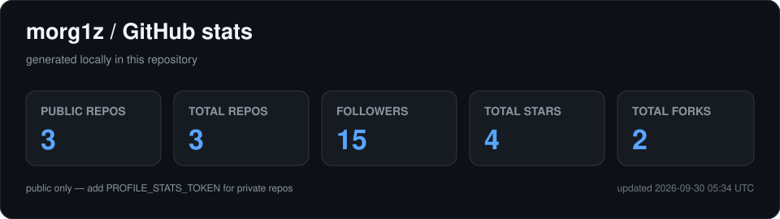

<div align="center">


# Radim Ilek

**IT student building Android apps, web products, network tools and game systems.**

<a href="https://github.com/morg1z">
  
</a>
<a href="https://www.linkedin.com/in/radim-ilek-0659bb2a2/">
  
</a>
<a href="https://x.com/morg1z">
  
</a>

<br>

<a href="https://github.com/morg1z?tab=followers">
  
</a>


</div>

---

## About me

- 🔭 Currently building **Jiyu**, **WiAn** and **The Writing Mage**
- 🌱 Exploring **Kotlin Multiplatform**, networking and backend architecture
- 💬 Ask me about **Android, Kotlin, TypeScript, PostgreSQL or Supabase**
- ⚡ Most of my projects start with *“this should be pretty simple”*

---

## Stack

### Languages

<p>
  
  
  
  
  
  
  
</p>

### Web

<p>
  
  
  
  
</p>

### Android / Application

<p>
  
  
  
  
  
</p>

### Data

<p>
  
  
  
</p>

### Tools & Infrastructure

<p>
  
  
  
  
  
  
  
</p>

---

## Featured projects

<table>
<tr>
<td width="50%" valign="top">

### [Jiyu](https://github.com/morg1z/jiyu)

Android manga, manhwa & light novel reader with AI-powered translation and a unified reading experience.


</td>
<td width="50%" valign="top">

### WiAn

Wi-Fi, LAN & CPE diagnostics focused on real measurements, evidence and troubleshooting.


</td>
</tr>
<tr>
<td width="50%" valign="top">

### The Writing Mage

Fantasy typing RPG built around spell-casting, progression and original pixel-art combat.


</td>
<td width="50%" valign="top">

### Alpeja

Modern website and booking system for a massage studio.


</td>
</tr>
</table>

---

## GitHub activity

<p align="center">
  
</p>

<sub>The activity card is generated inside this repository with GitHub Actions instead of depending on a public stats endpoint.</sub>

---

<details>
<summary><b>Currently</b></summary>
<br>

```text
morg1z@now:~$ status

01  refining Jiyu and its translation workflow
02  building WiAn around useful network diagnostics
03  developing The Writing Mage and its combat systems
04  building practical web projects
05  learning by shipping
```

</details>

<br>

<div align="center">
  <sub>software · mobile · web · systems</sub>
</div>
